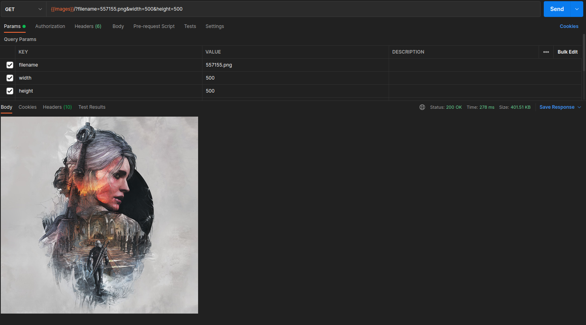
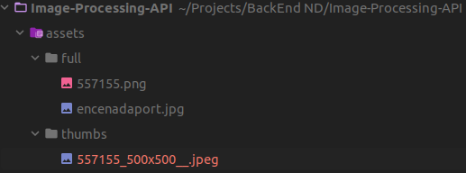

# IMAGE_PROCESSING API

There are two ways to use this API, it makes it easier for developers who are building a Front-End to use it as a Place holder for Prototyping with customizable URL Parameters. The API could also be used as an Image Processing Library for On-Run Results .

- Place Holder API : Faster Prototyping with Customization via URL Parameters
- Image Processing Library : Including Scaling, Rotating, Blurring images and Transforming to different Image Formats.

## API Reference

#### Resizing

```http
  GET /api/v1/images/?filename=..&width=..&height=..
```

| Parameter  | Type     | Description                                 |
| :--------- | :------- | :------------------------------------------ |
| `filename` | `string` | **Required**. Image Filename in assets/full |
| `width`    | `string` | New Image Width                             |
| `height`   | `string` | New Image height                            |
| `format`   | `string`   | Transforming to different image format      |

- Leaving both `width` & `height` will produce the same input image,
- Leaving `format` empty will save the image with its original format

#### Rotation

```http
  GET /api/v1/images/?filename=..&rotate=..
```

| Parameter | Type     | Description                  |
| :-------- | :------- | :--------------------------- |
| `rotate`  | `string` | **Required**. Rotation Angle |

#### Blurring

```http
  GET /api/v1/images/?filename=..&blur=..
```

| Parameter | Type     | Description                          |
| :-------- | :------- | :----------------------------------- |
| `blur`    | `string` | **Required**. Sigma used in Blurring |

_Note:_ Adding all Parameters will pipeline all Transformations together.

- More Feature to be added soon.

## Responses

The API results are presented in two ways as mentioned before, the HTTP response contain the processed
image in a placeholder URL and also saved into `./assets/thumbs/` with a meaningful name describing how it was
processed

###### Example

```http
  GET /api/v1/images/?width=500&height=500&format=jpeg&filename=557155.png
```

The API Endpoint was tested with Postman and built with Webstrom IDE, the following are examples of both usages of the API . The First Image is the Placeholder response, after inspecting the returned page it can be seen that the image source is the URL itself :

` `

The Second image shows the resulted processed image saved into its path in `assets/` with the name `557155_500x500__.jpeg` explaining the processes done.





## Optimizations

An ordinary request takes about 200 ms Response time which includes processing and saving into `./assets/thumbs`
on a bigger Pipeline this would be troublesome so Caching is used to save some time.

There are multiple Caching Middle-ware scattered along the NPM Libraries, The Middle ware used here
is one of the simple ones:

-     `"apicache": "^1.6.3"`

This package requires only Importing and you're good to go, Response times improved for multiple requests on the same images ( about 4 -5 ms).

## Run Locally

The API was built using Typescript and Express.js, all working versions are included in `package.json` with uploaded
`package-lock.json`, to run project :

Clone the project

```bash
  git clone https://github.com/Ahmad-Abdalmageed/Image-Processing-API.git
```

- or using ssh

Go to the project directory

```bash
  cd Image-Processing-API
```

Install dependencies

```bash
  npm install
```

Start the server

```bash
  npm run start
```

All Scripts used to run this program are also included in `package.json` with scripts to run
`Prettier@2.6.2`
&& `Eslint@8.15.0`

```json
    "start" : "nodemon src/app.ts",
    "build": "npx tsc",
    "dist": "node build/app.js",
    "jasmine": "jasmine",
    "lint": "eslint \"**/*.ts\" --ignore-pattern node_modules/",
    "prettier": "prettier --config .prettierrc '**/*.ts' --write",
    "test": "npm run build && npm run jasmine"
```
